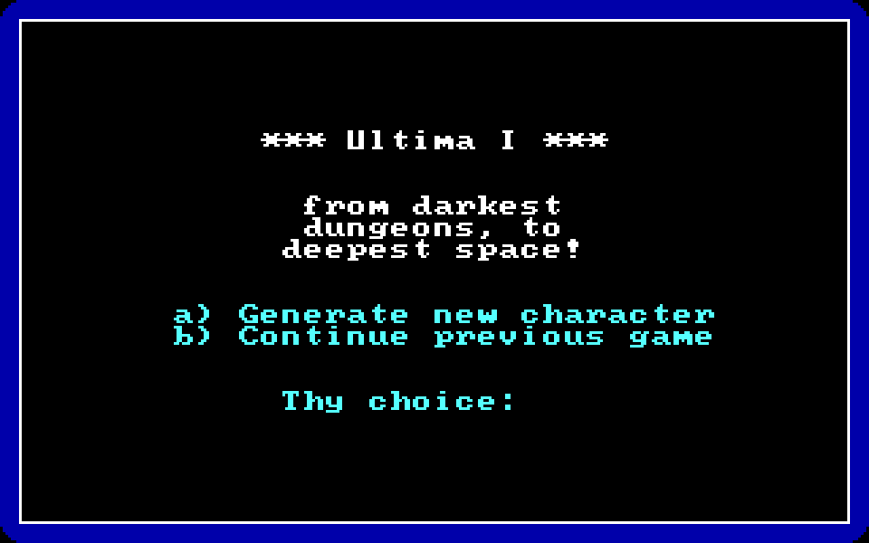
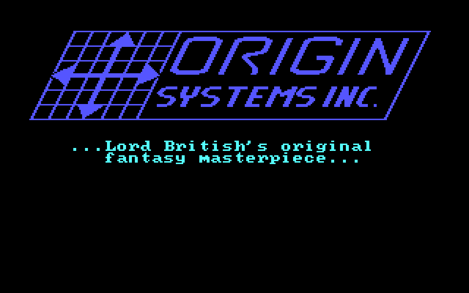

# Ultima I on iOS

**Play Ultima I: The First Age of Darkness on your iPhone or iPad** — the complete,
original DOS game, running in DOSBox, booting straight into the game with a gem icon.

It's built on [dospad](https://github.com/litchie/dospad) (the open-source iOS DOSBox,
GPLv2), cloned and patched at build time, plus **your own** copy of Ultima I.

> **You must own Ultima I.** It isn't free, so **no game data is included in this repo** —
> the build copies your own copy onto the device. The DOSBox app is cloned + patched at
> build time, not re-hosted here.

## 📸 Screenshots

The real Ultima I, running in DOSBox — the app boots straight into it:

<p align="center">
  
  &nbsp;&nbsp;
  
</p>

## 🚀 Install

Requires a **Mac** with **Xcode** and **git** (no Mac? see [💻 No Mac?](#-no-mac-sideload-the-prebuilt-app) below).

**On your iPhone/iPad** (needs just a free Apple ID — one command):

```sh
git clone https://github.com/dmaynard51/ultima1-ios.git
cd ultima1-ios
dosbox/build-ios-dosbox.sh          # Team ID is auto-detected; pass yours to override
```

That's it — it clones the iOS DOSBox, patches it to auto-run Ultima I, brands it with
the gem icon and the name "Ultima I", builds, signs, installs, and copies your game
data onto the device. First run on the phone: **trust the app once** under **Settings ▸
General ▸ VPN & Device Management**, then reopen — it boots straight into the game.

By default it reads your U1 data from `/Applications/Ultima I™.app/Contents/Resources/game`
(a Mac GOG install — the **[Ultima 1+2+3 bundle](https://www.gog.com/game/ultima_123)**).
If yours is elsewhere, pass the folder (the one with `ULTIMA.EXE`) as the last argument:

```sh
dosbox/build-ios-dosbox.sh ABCDE12345 "/path/to/your/ultimaI/game"
```

(Find your Team ID: `security find-identity -v -p codesigning` — the code in parentheses.)

> **No paid Apple Developer account ($99/yr) needed.** Installing to your own device
> is free with any Apple ID. The build **strips the extra app-extension** so a free
> "Personal Team" has just one target to sign — the usual cause of the bogus "$99 to
> add a device" wall. If command-line signing still fails (Apple blocks free-account
> CLI signing), the script prints the exact free **Xcode ▸ Run ▶** steps. Note a free
> Apple ID can keep **3 sideloaded apps installed at once** and re-signs every 7 days.

## 💻 No Mac? Install the prebuilt IPA

No Mac or Xcode needed — download the prebuilt app and sideload it from **Windows, Linux,
or Mac** with a **free Apple ID**.

**1. Get the app.** Download **[Ultima I.ipa](https://github.com/dmaynard51/ultima1-ios/releases/latest)** from Releases.

**2. Install it** (pick one):
- **[Sideloadly](https://sideloadly.io)** (Win/Mac/Linux) — plug in the phone, drag in the
  `.ipa`, enter your **free Apple ID**, click **Start**. Then trust the cert on the phone
  under **Settings ▸ General ▸ VPN & Device Management** and open the app.
- **[AltStore](https://altstore.io)** — same idea, and it auto-refreshes the 7-day signature
  over Wi-Fi so you don't have to re-sign weekly.
- **TrollStore** (no computer, *if* your iOS supports it) — just open the `.ipa` in the Files
  app and it installs permanently. In the EU, **AltStore PAL** also needs no computer.

**3. Add your own game files** (the app ships with **none**). You need your legally-owned
Ultima I DOS files — the folder that contains **`ULTIMA.EXE`** (e.g. from your GOG copy). Copy them
onto the phone by either:
- **Files app → On My iPhone → Ultima I** → paste your game files in, **or**
- **iTunes / Finder → phone → File Sharing → Ultima I** → drag the files into its Documents box.

> ⚠️ **Put the files LOOSE at the root — not inside a folder.** That Ultima I folder *is* the
> game's `C:\` drive, and the app auto-runs `ULTIMA.EXE` from `C:\`. If you drag a *folder* in
> (so the files land in `C:\YourFolder\`), the app opens to a bare **`C:\>`** prompt instead
> of the game. Fix: in the **Files** app, open that subfolder → **•••  ▸ Select ▸ Select All**
> → **Move** → up one level into the **Ultima I** folder.

**4. Open Ultima I** — it boots straight into the game (landscape, D-pad + command keyboard, sound).


## 🎮 Playing

The app runs in **landscape** with a purpose-built control layout (no fiddly DOS
keyboard or toolbar):

- a **movement D-pad** on the left,
- the frequent **Ultima I commands** as labelled buttons — Attack, Board, Cast, Enter, Get, Klimb, Open, Ready, Talk, Unlock, View, Ztats,
- a utility row: **⌨** (full keyboard), **Esc**, **↵**, **Pass**, **Yes**, **No**.

The game screen sits above the controls (nothing is covered), and there's **sound**.
When you need to type, tap **⌨** for a full QWERTY, and **⌨▸CMDS** flips back.

## ☕ Support this port

- ☕ **[Buy me a coffee (Ko-fi)](https://ko-fi.com/dmaynard)**
- 💜 **[GitHub Sponsors](https://github.com/sponsors/dmaynard51)**

## 🙏 Credits & license

- iOS DOSBox: **[dospad](https://github.com/litchie/dospad)** by litchie (GPLv2) —
  cloned + patched at build time.
- Gem app icon and the build script: MIT — see [LICENSE](LICENSE).
- *Ultima I* and its data are © Origin Systems / Electronic Arts. This project ships
  none of it; you bring your own legally-owned copy.
